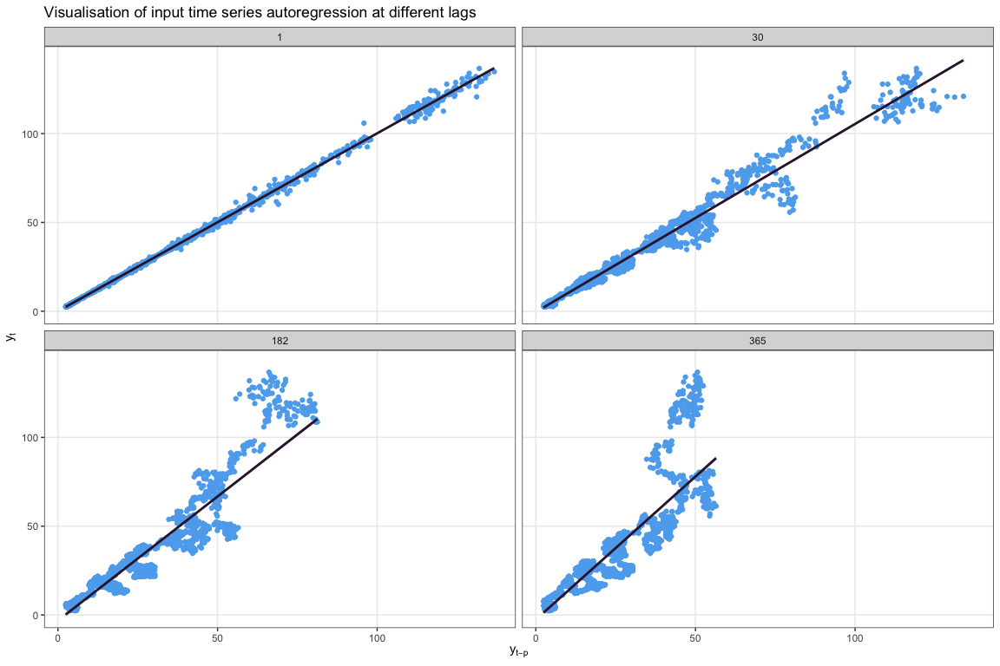

# laggeR

Visualisation of lagged time series and autoregression in R.

## Installation

You can install `laggeR` from GitHub by running the following:

``` r
devtools::install_github("hendersontrent/laggeR")
```

## Motivation

Operations such as autocorrelation function (ACF) and partial
autocorrelation function (PACF) are immensely useful for understanding
the lagged structure of a time series. However, without an immediate
knowledge of how they (or autocorrelation in general) works, it can be
difficult to deeply understand the structure of your time series. This
package automates data visualisations in a basic format (bivariate
scatterplot) and statistical computations so you can more easily see how
well different lagged versions of your time series (or another time
series) predict values of your time series.

## Core functions

### plot\_ar()

Produces a matrix of scatterplots for various time lags and their linear
relationship with future values of your time series.

``` r
library(tidyverse)
library(scales)
library(data.table)
library(laggeR)

# Pull Apple stock time series data as a test

library(tidyquant)
getSymbols("AAPL", warnings = FALSE,
           auto.assign = TRUE)

# Plot with the function

plot_ar(timeseries = as.vector(AAPL$AAPL.Adjusted))
```

<!-- -->

You can also specify a vector of time lags if you some a priori
understanding of potentially informative lags.

``` r
plot_ar(timeseries = as.vector(AAPL$AAPL.Adjusted), lags = c(1,30,182,365))
```

<!-- -->

You can opt to return a dataframe of statistical model outputs for each
lagged regression instead of a plot.

``` r
outputs <- plot_ar(timeseries = as.vector(AAPL$AAPL.Adjusted), lags = c(1,30,182,365), plot = FALSE)
head(outputs)
```

``` 
   r.squared adj.r.squared      sigma  statistic p.value df     logLik
1: 0.9989885     0.9989883  0.8070206 3485503.75       0  1  -4252.204
2: 0.9747362     0.9747290  4.0353590  135038.25       0  1  -9853.746
3: 0.8840767     0.8840421  8.6712809   25533.16       0  1 -11988.499
4: 0.7729099     0.7728382 12.1954201   10772.20       0  1 -12413.637
         AIC       BIC   deviance df.residual nobs lag
1:  8510.407  8528.915   2298.375        3529 3531   1
2: 19713.492 19731.975  56994.429        3500 3502  30
3: 23982.998 24001.348 251739.842        3348 3350 182
4: 24833.273 24851.455 470724.976        3165 3167 365
```

### plot\_ar\_multiv()

This function extends the univariate time series case presented in
`plot_ar()` to the multivariate space, where lagged values of a time
series `x` are used to predict values in a time series of interest `y`.
This is similar to the concept of [Granger
causality](https://en.wikipedia.org/wiki/Granger_causality).

``` r
library(tidyverse)
library(scales)
library(data.table)
library(laggeR)

# Pull Apple and Microsoft stock time series data as a test

library(tidyquant)
getSymbols("AAPL", warnings = FALSE,
           auto.assign = TRUE)

getSymbols("MSFT", warnings = FALSE,
           auto.assign = TRUE)

# Plot with the function

plot_ar_multiv(timeseriesx = as.vector(MSFT$MSFT.Adjusted),
               timeseriesy = as.vector(AAPL$AAPL.Adjusted))
```

<!-- -->

Similar to `plot_ar()`, you can also specify a vector of time lags.

``` r
plot_ar_multiv(timeseriesx = as.vector(MSFT$MSFT.Adjusted),
               timeseriesy = as.vector(AAPL$AAPL.Adjusted),
               lags = c(1,30,182,365))
```

<!-- -->

You can also opt to return a dataframe of statistical model outputs for
each lagged regression instead of a plot.

``` r
outputs <- plot_ar_multiv(timeseriesx = as.vector(MSFT$MSFT.Adjusted),
               timeseriesy = as.vector(AAPL$AAPL.Adjusted), plot = FALSE)
head(outputs)
```

``` 
   r.squared adj.r.squared    sigma statistic p.value df    logLik      AIC
1: 0.9406607     0.9406439 6.181337  55942.57       0  1 -11441.11 22888.22
2: 0.9406488     0.9406320 6.182068  55914.77       0  1 -11438.29 22882.57
3: 0.9404871     0.9404702 6.190594  55737.44       0  1 -11439.91 22885.82
4: 0.9402627     0.9402457 6.202365  55499.05       0  1 -11443.37 22892.74
5: 0.9401119     0.9400949 6.210308  55334.80       0  1 -11444.64 22895.28
6: 0.9398338     0.9398167 6.224846  55047.05       0  1 -11449.64 22905.28
        BIC deviance df.residual nobs lag
1: 22906.73 134839.3        3529 3531   1
2: 22901.08 134833.0        3528 3530   2
3: 22904.33 135166.8        3527 3529   3
4: 22911.25 135642.8        3526 3528   4
5: 22913.79 135951.9        3525 3527   5
6: 22923.78 136550.5        3524 3526   6
```

## Important notes

Functionality does not currently support smoothed fits, such as in a
[generalised additive
model](https://en.wikipedia.org/wiki/Generalized_additive_model), nor do
the statistical tests assess assumptions or perform model diagnostics.
These are slated for future version releases.

## Further work

More functionality is currently under development. Please check back
soon\!
