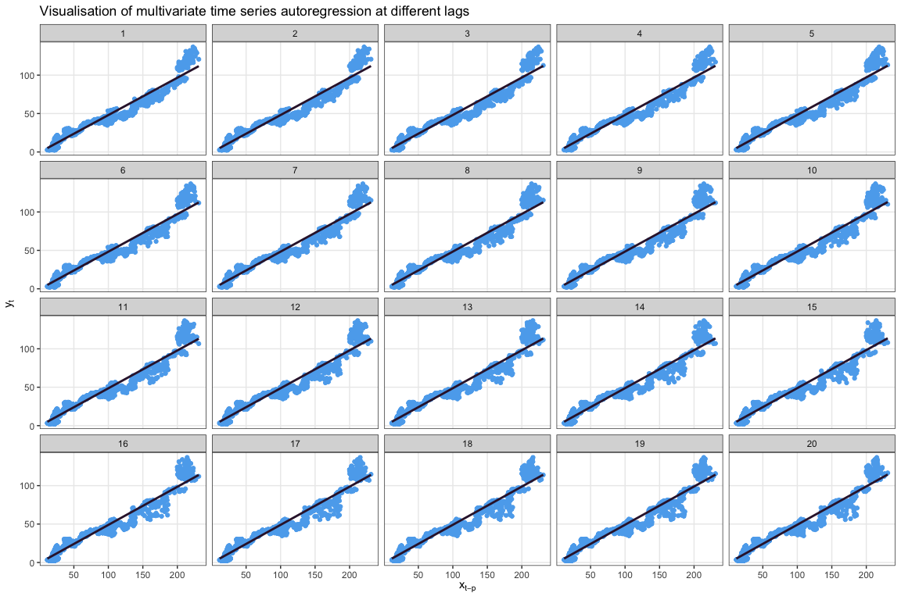

# laggeR

Visualisation of lagged time series and autoregression in R.

## Installation

You can install `laggeR` from GitHub by running the following:

``` r
devtools::install_github("hendersontrent/laggeR")
```

## Motivation

Operations such as autocorrelation function (ACF) and partial
autocorrelation function (PACF) are immensely useful for understanding
the lagged structure of a time series. However, without an immediate
knowledge of how they (or autocorrelation in general) works, it can be
difficult to deeply understand the structure of your time series. This
package automates data visualisations in a basic format (bivariate
scatterplot) so you can more easily see how well different lagged
versions of your time series (or another time series) predict values of
your time series.

## Core functions

### plot\_ar()

Produces a matrix of scatterplots for various time lags and their linear
predictive relationship on future values of your time series. Includes
p-values and R-squared values by default for all visualised time lags,
though no model diagnostics or assumption checks are currently built in.

``` r
library(tidyverse)
library(scales)
library(data.table)
library(laggeR)

# For extracting some financial time series as a test

library(tidyquant)
getSymbols("AAPL", warnings = FALSE,
           auto.assign = TRUE)

# Plot it

plot_ar(timeseries = as.vector(AAPL$AAPL.Adjusted))
```

<!-- -->

You can also specify a vector of time lags if you some a priori
understanding of potentially informative lags.

``` r
plot_ar(timeseries = as.vector(AAPL$AAPL.Adjusted), lags = c(1,30,182,365))
```

<!-- -->

### plot\_ar\_multiv()

This function extends the univariate time series case presented in
`plot_ar()` to the multivariate space, where lagged values of a time
series `x` are used to predict values in a time series of interest `y`.
This is similar to the concept of [Granger
causality](https://en.wikipedia.org/wiki/Granger_causality).

``` r
library(tidyverse)
library(scales)
library(data.table)
library(laggeR)

# For extracting some financial time series as a test

library(tidyquant)
getSymbols("AAPL", warnings = FALSE,
           auto.assign = TRUE)

getSymbols("MSFT", warnings = FALSE,
           auto.assign = TRUE)

# Plot it

plot_ar_multiv(timeseriesx = as.vector(MSFT$MSFT.Adjusted),
               timeseriesy = as.vector(AAPL$AAPL.Adjusted))
```

<!-- -->

Similar to `plot_ar()`, you can also specify a vector of time lags.

``` r
plot_ar_multiv(timeseriesx = as.vector(MSFT$MSFT.Adjusted),
               timeseriesy = as.vector(AAPL$AAPL.Adjusted),
               lags = c(1,30,182,365))
```

<!-- -->

## Further work

More functions are currently under development. Please check back soon\!
